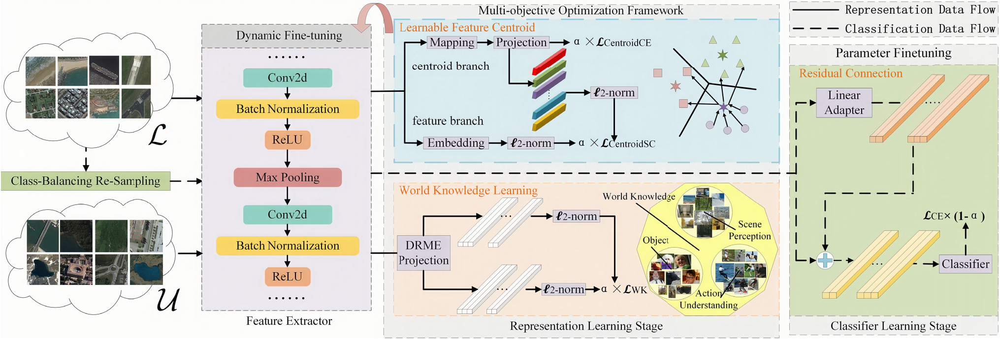

<h1 align="center">☀️DECOR☀️</h1>

<h3 align="center" style="font-family: 'Times New Roman'; font-size: 10px;">
DECOR: Dynamic Decoupling and Multi-Objective Optimization for Long-tailed Remote Sensing Image Classification
</h3>

<p align="center">
Jianlin Xie<sup>1</sup>, Guanqun Wang<sup>2</sup><sup>*</sup>, Yin Zhuang<sup>1</sup>, Can Li<sup>1</sup>, Tong Zhang<sup>1</sup>, He Chen<sup>1</sup>, Liang Chen<sup>1</sup>, Shanghang Zhang<sup>2</sup>
</p>

<p align="center">
<sup>1</sup> Beijing Institute of Technology, <sup>2</sup> Peking University
</p>

<h2 style="font-family: 'Times New Roman'; font-size: 15px;">🔥Updates</h2>

- 🗓️**May 5th, 2025**: The DECOR repo has been further optimized.

<h2 style="font-family: 'Times New Roman'; font-size: 15px;">🎯Overview & Contribution</h2>


Our main contributions are:
- A DD **(dynamic decoupling)** framework is proposed that allows the model to make a better representation of learning and classifier learning, and also ensure the compatibility of the feature extractor with the classifier.
- MOOF **(multiobjective optimization framework)** is proposed to make a better representation of learning including supervised contrastive learning with LFC and self-supervised contrastive learning. LFCs enable a more explicit connection between the feature extractor and the classifier. Self-supervised contrastive learning provides the model with contextual knowledge about the world.
- A LOFT **(lightweight optimization fine-tuning)** is employed for the goal of maximum performance with minimal intervention.
- A high-spatial-resolution remote sensing image long-tailed dataset containing 50 classes of objects has been constructed by ourselves and will be made publicly available to other researchers. The self-built BIT-AFGR50 is available at https://github.com/wgqqgw/BIT-KTYG-AFGR.

<h2 style="font-family: 'Times New Roman'; font-size: 15px;">
🧾Getting Started
</h2>

<h3 style="font-family: 'Times New Roman'; font-size: 15px;">
1. Installation
</h3>

DECOR is developed based on python==3.9.11 torch==1.11.0 and torchvision==0.12.0. Check more details in requirements.

<h3 style="font-family: 'Times New Roman'; font-size: 15px;">
i. Clone Project
</h3>

```
git clone https://github.com/ChloeeGrace/DECOR.git
```

<h3 style="font-family: 'Times New Roman'; font-size: 15px;">
ii. Install
</h3>

```
pip install -r requirements.txt
```

<h3 style="font-family: 'Times New Roman'; font-size: 15px;">
2. Data Preparation
</h3>

The file **self_con.txt** comprises data from ImageNet. The contents of self_con.txt are the path to the Imagenet data.

**For example:**  
> /data/Datasets/Imagenet/train_img/n04548362_10933.JPEG  
> /data/Datasets/Imagenet/train_img/n02364673_632.JPEG  
> /data/Datasets/Imagenet/train_img/n02033041_2659.JPEG  
> /data/Datasets/Imagenet/train_img/n03085013_30335.JPEG  
> /data/Datasets/Imagenet/train_img/n04532106_1429.JPEG  
> /data/Datasets/Imagenet/train_img/n02788148_40948.JPEG  

<h2 style="font-family: 'Times New Roman'; font-size: 15px;">🏋️‍♂️Training</h2>

```
bash training.sh
```

<h2 style="font-family: 'Times New Roman'; font-size: 15px;">🤖Inference</h2>

```
bash Inference.sh
```

<h2 style="font-family: 'Times New Roman'; font-size: 15px;">🔔Notice</h2>

In light of everyone's interest in long-tailed distribution, we will soon release a more detailed and comprehensive version to support your research.

<h2 style="font-family: 'Times New Roman'; font-size: 15px;">📢Contact</h2>

If you have any questions, suggestions or spot a bug, feel free to get in touch. We would also love to see your contributions. Just open a pull request if you'd like to help out. Thanks so much for your support!
